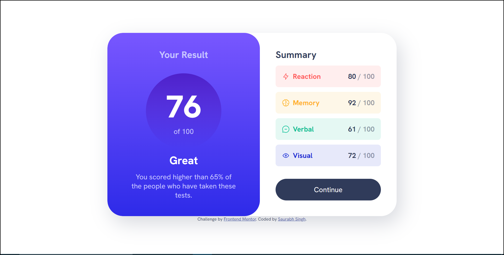
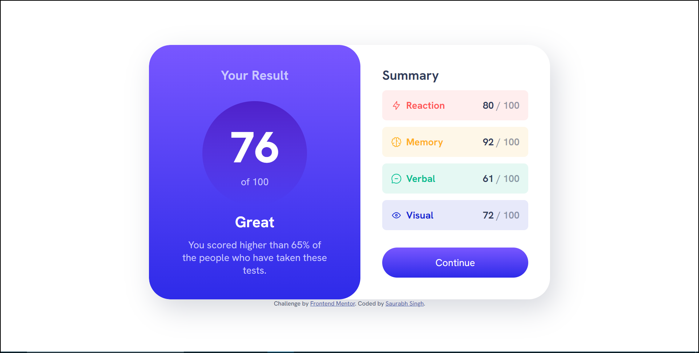
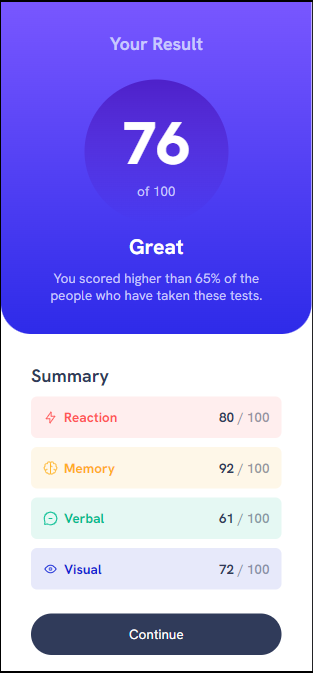
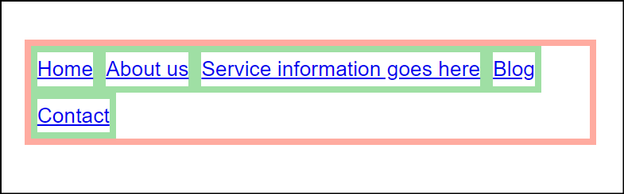

# Frontend Mentor - Results summary component solution

This is a solution to the [Results summary component challenge on Frontend Mentor](https://www.frontendmentor.io/challenges/results-summary-component-CE_K6s0maV). Frontend Mentor challenges help you improve your coding skills by building realistic projects. 

## Table of contents

- [Overview](#overview)
  - [The challenge](#the-challenge)
  - [Screenshot](#screenshot)
  - [Links](#links)
- [My process](#my-process)
  - [Built with](#built-with)
  - [What I learned](#what-i-learned)
- [Author](#author)

## Overview

### The challenge

Users should be able to:

- View the optimal layout for the interface depending on their device's screen size
- See hover and focus states for all interactive elements on the page

### Screenshot

* Desktop Design

* Desktop Design Active States

* Mobile Design

### Links

- Live Site URL: [https://saurabh-gih.github.io/result-summary-component-main/](https://saurabh-gih.github.io/result-summary-component-main/)

## My process

### Built with

- Semantic HTML5 markup
- CSS custom properties
- Flexbox
- CSS Grid
- Mobile-first workflow
- Vanilla CSS

### What I learned

- Revised Flexbox

## Flexbox

#### `display: flex;`

* Makes nav-list or `ul` flexbox and its children `li` flex-items
* Display block and inline will not work on `li` as they are now flex items.
             

#### Behaviour of width of li in `display: block;`

1. `width: max-content`

2. `width: min-content`

3. `default width`

#### Default behaviour of width of li in `display: flex;`

* **enough room** => width: max-content [items are of size of their content]

* **not enough room** => width: min-content [content of flexitem will shrink to minimum possible]

* `flex-shrink: 1` /* default */

* `flex-shrink: 0`

* `flex-grow: 1` will distribute the remaining space left in the flexbox to flex-items.

* **Parent property** `flex-wrap: wrap;` will wrap items as soon as they run out of space instead of shrinking them.

> when items can no longer wrap they will then shrink.

## Columns are not even size

**Trick 1 :** To make coulumns of even size set `flex: 1;`.

Shorthand property made of: 
    * `flex-grow: 1;`: flex-items grows to take remaining space in flexbox.
    * `flex-shrink: 1`: flex-items are allowed to shrink if they run out of space.
    * `flex-basis: 0`: sets the flex-basis to zero.

> **Flex-basis:** It accepts the same values as the *width* and height property, **plus content**.

#### Different behaviour of flex-basis

`flex-basis: auto`/* default value */ and `flex-shrink: 0;` and `flex-grow: 0;` 

`flex-basis: 300px` and `flex-shrink: 0;`

`flex-basis: 0px` and `flex-shrink: 0;`

**Trick 2 :** Set `flex-basis: 100%` or `width: 100%`. As `flex-shrink: 1` is default. All element will be of 100% width of parent and then shrink by same rate to fit the parent.

* `align-items: stretch;` streches the items to height of the flexbox.

## Author

- Frontend Mentor - [@saurabhisdev](https://www.frontendmentor.io/profile/saurabhisdev)
- Twitter - [@saurabh__twt](https://twitter.com/saurabh__twt)
